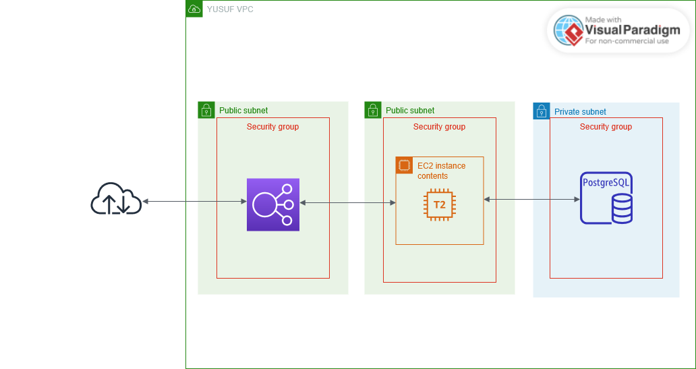

# Foods API

This repository explains what the application is for and how it is deployed to be accessed to Internet.

## What is Foods API

Foods API is an application with Go v1.23.3 as a programming language that returns some foods and their price. Foods API exposes one single API endpoint, that is `/api/foods`.

## How to Build and Run

To build the Go app, simply run `go build -o foods-api`. If you want to dockerized it, simply run `docker build -t <image-name> .`

Before you run the app, you must have a database in Postgresql. You can run the SQL script in `database` folder to create database, table, and insert data. After that, add environment variable `DATABASE_URL` in your computer with this value: `postgresql://<db-user>:<db-password>@<db-host>:<db-port>/<db-name>`

If you have set the database, you can run the app with `./foods-api`. If you want it to run in Docker, then run this command: `docker run -d --name foods-api -e DATABASE_URL=<DATABASE_URL> -p 8080:8080 <docker-image-name>` 

## How it is Deployed

This application will be containerized with Docker and is going to be deployed automatically to AWS EC2 with CI/CD using Github Actions.

Before you run the CI/CD, add some secrets in Actions secrets and variables.

```
DATABASE_URL=<DATABASE-URL>
DOCKERHUB_PASSWORD=<DOCKERHUB-PASSWORD>
DOCKERHUB_USER=<DOCKERHUB-USER>
SSH_HOST=<EC2-PUBLIC-IP>
SSH_KEY=<SSH-PRIVATE-KEY>
SSH_USER=<EC2-USER>
```

After that, you can finally run the CI/CD.

## Where Will the Application be Deployed?

Foods API will be deployed on AWS EC2 with specific VPC, Subnets, Security Groups, and database. Here is the AWS architecture diagram.



As you can see, the AWS services used are:

1. Compute service
  - EC2

    This server will have Docker installed. I used EC2 because it is easy to create and more flexible when compared to ECS.

2. Database service
  - RDS

    RDS is used to store some data. I used this service because it is quick and easy to create and have great offers such as high scalability and availability, and security.

3. Networking service
  - VPC

    VPC is used to isolate the infrastructure. In this VPC, there will have 1 availability zone, 1 public subnet, and 1 private subnet.

  - Elastic Load Balancer

    This service will distribute and balance incoming traffic to EC2 service.

  - Security Groups

    This service will act as a firewall. I created 3 security groups:

    -  Security groups for ELB: will allow all inbound traffic from anywhere to port 80.
    - Security groups for EC2: will open 8080 port to allow traffic from ELB, and will allow all outbound trafiic to allTCP ports.
    - Security groups for RDS: will open 5432 port to allow traffic from EC2.